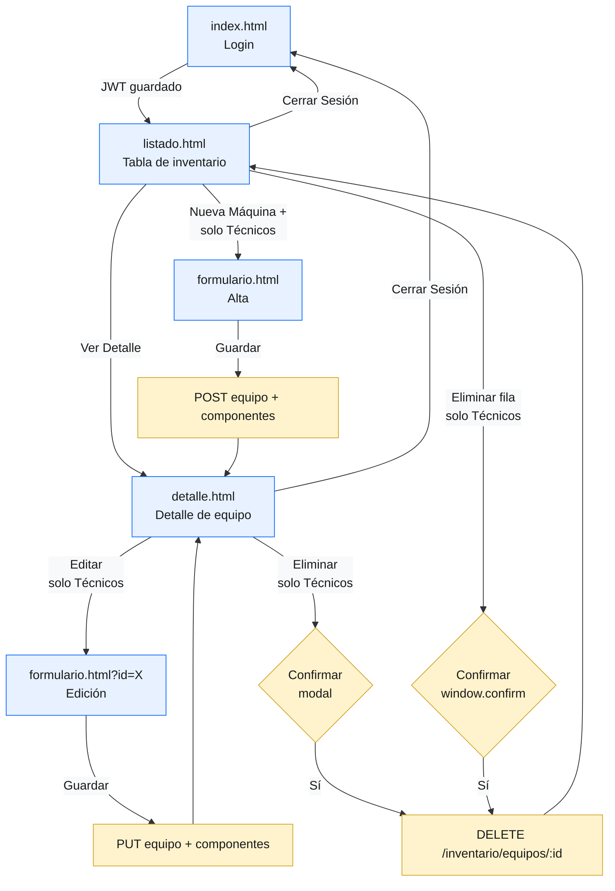

# Frontend — Proyecto Inventario EGI "Ecosistema de Inventario Seguro"

Interfaz web desarrollada con HTML + CSS + JavaScript vanilla y Bootstrap 5 para el sistema de inventario de equipos de laboratorio del ITU. Consume la API REST del backend (FastAPI) para autenticar usuarios contra Active Directory y gestionar el ciclo de vida completo de los equipos: alta, consulta, edición y eliminación, combinando datos de ubicación (SQL Server) y hardware (MongoDB) en una sola vista.

## Tabla de contenidos
- [Arquitectura](#arquitectura)
- [Páginas de la aplicación](#páginas-de-la-aplicación)
- [Autenticación y roles](#autenticación-y-roles)
- [Cómo se comunica con el backend](#cómo-se-comunica-con-el-backend)
- [Puesta en marcha](#puesta-en-marcha)
- [Estructura del proyecto](#estructura-del-proyecto)
- [Tecnologías](#tecnologías)

## Arquitectura

El frontend está compuesto por varias páginas HTML separadas (no usa un framework como React o Angular), y cada archivo tiene una responsabilidad clara:

| Capa | Responsabilidad |
|---|---|
| `*.html` | Estructura y diseño de cada pantalla (con Bootstrap 5) |
| `js/api.js` | Único punto de contacto con el backend: login, token, peticiones autenticadas, funciones de apoyo para el inventario |
| `js/login.js`, `listado.js`, `detalle.js`, `formulario.js` | Lógica de cada pantalla: eventos de botones, validaciones, mostrar la información en la página |
| `css/style.css` | Estilos propios, además de los que trae Bootstrap |

Ninguna página llama directamente al backend: todas pasan por `api.js`, que se encarga de la dirección base de la API (`/api`), de enviar el token JWT en cada pedido y de manejar cuando la sesión expiró o no es válida (error 401).

## Páginas de la aplicación

| Página | Script | Descripción | Acceso |
|---|---|---|---|
| `index.html` | `login.js` | Formulario de login contra Active Directory | Público |
| `listado.html` | `listado.js` | Tabla de inventario con filtros por tipo y ubicación | Autenticado |
| `detalle.html` | `detalle.js` | Vista completa de un equipo (ubicación + hardware) | Autenticado |
| `formulario.html` | `formulario.js` | Alta y edición de equipos (mismo formulario, modo dual) | Solo Técnicos |

### Flujo de navegación



## Autenticación y roles

El flujo de login implementado en `login.js` + `api.js`:

1. El usuario completa usuario y contraseña en `index.html`.
2. `login.js` valida que los campos no estén vacíos antes de llamar a la API.
3. `api.js` envía las credenciales como `application/x-www-form-urlencoded` a `POST /auth/login`.
4. Si el backend responde `200 OK`, se guarda el `access_token` (JWT) en `localStorage`.
5. Si responde `401`, se muestra un mensaje de error de credenciales.
6. Si la conexión falla (red/servidor caído), se muestra un mensaje de error de conexión distinto.
7. El JWT se lee directamente en el navegador (`obtenerPayloadToken()`) para obtener el usuario (`sub`) y el rol, sin necesidad de pedirlos otra vez al backend.

Control de acceso desde el navegador (repite las mismas reglas del backend, pero **no las reemplaza** — quien realmente decide siempre es el backend):

| Acción | Roles permitidos | Comportamiento en frontend |
|---|---|---|
| Ver listado y detalle | Cualquier usuario autenticado | Acceso normal |
| Botón "Nueva Máquina +" | Solo Técnicos | Oculto para Docentes/Alumnos |
| Botones "Editar" / "Eliminar" | Solo Técnicos | Ocultos para Docentes/Alumnos |
| Acceso directo a `formulario.html` | Solo Técnicos | Redirige a `listado.html` si el rol no es válido |
| Token expirado o ausente | — | Redirige a `index.html` y limpia la sesión |

Los errores `403` que devuelve el backend (usuario autenticado pero sin permiso) también se manejan explícitamente en cada acción de escritura, mostrando un mensaje al usuario en lugar de fallar en silencio.

## Cómo se comunica con el backend

Todas las llamadas al backend pasan por `js/api.js`, que ofrece:

- **Sesión**: `login()`, `guardarToken()`, `obtenerToken()`, `logout()`, `obtenerPayloadToken()`, `obtenerUsuario()`, `obtenerRolUsu()`, `isTokenExpired()`.
- **Peticiones con sesión**: `fetchWithAuth(path, options)` — agrega automáticamente el token en cada pedido (campo `Authorization: Bearer <token>`), revisa si el token ya expiró antes de enviarlo, y manda al usuario a `index.html` si el backend responde con error 401.
- **Inventario**: `obtenerInventario()`, `obtenerEquipo(id)`, `obtenerUbicaciones()`, `obtenerPersonas()`, `crearEquipo()`, `actualizarEquipo()`, `eliminarEquipo()`, `crearComponentes()`, `actualizarComponentes()`.
- **Interfaz**: `showMessage()` — función de apoyo para mostrar avisos de Bootstrap por unos segundos, sin repetir ese código en cada página.

```js
// Url del backend
const API_URL = "/api";
```

> El frontend espera que el backend esté disponible bajo el prefijo `/api` (a través de un proxy o configuración de red), no se conecta directamente a `http://localhost:8000` cuando está en producción.

## Puesta en marcha

### Requisitos previos
- Navegador moderno (Chrome, Edge, Firefox).
- Backend de la API corriendo y accesible (ver README del backend).
- Red del ITU o túnel equivalente con acceso al backend y a Active Directory.

### Desarrollo local

```bash
# Abrir directamente en el navegador
# (no requiere build ni servidor de desarrollo)
frontend/index.html
```

Si el backend corre en otro host/puerto, ajustar `API_URL` en `js/api.js` o configurar un proxy.

### Despliegue en contenedor (Nginx)

El frontend se sirve como contenido estático mediante Nginx dentro de Kubernetes:

```bash
docker build -t inventario-frontend ./docker/frontend
docker run -p 80:80 inventario-frontend
```

El `nginx.conf` correspondiente redirige las llamadas a `/api/*` hacia el backend dentro del clúster.

## Estructura del proyecto

```
frontend/
├── index.html          # Login
├── listado.html        # Tabla de equipos con filtros
├── detalle.html        # Detalle completo de un equipo
├── formulario.html      # Alta / edición (solo Técnicos)
├── js/
│   ├── api.js            # Sesión, peticiones con token, llamadas al backend
│   ├── login.js           # Lógica de la pantalla de login
│   ├── listado.js         # Carga, filtrado y armado de la tabla
│   ├── detalle.js         # Carga y muestra el detalle de un equipo
│   └── formulario.js      # Alta/edición: carga de selects, validación, guardado
├── css/
│   └── style.css         # Estilos propios
└── img/                  # Logo institucional, íconos
```

## Tecnologías

| Tecnología | Uso |
|---|---|
| HTML5 / CSS3 | Estructura y estilos base |
| JavaScript (módulos ES, sin frameworks) | Lógica de cada pantalla |
| Bootstrap 5 | Diseño y componentes listos para usar (modales, barra de navegación, menús desplegables) |
| Bootstrap Icons | Iconos |
| Fetch API | Comunicación con el backend (peticiones REST) |
| JWT (lectura en el navegador) | Obtener el usuario y el rol sin pedirlos otra vez al backend |
| Nginx | Servidor de archivos estáticos en el despliegue con Kubernetes |
